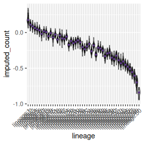
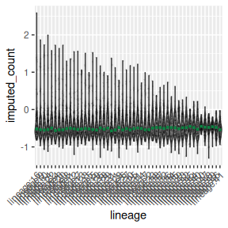

# Simulation

## Overall requirements on running CYFER

### Quick API map (what each function does)

- **`cyfer(...)`** K-fold CV over a decreasing λ-sequence produced by
  [`lineage_imputation_sequence()`](https://nancyrzhanglab.github.io/multiomeFate/reference/lineage_imputation_sequence.md).
  For each fold, trains on `cell_features[-fold]` and evaluates the
  *unpenalized* objective on held-out cells (and on the train split).
  Returns a list (one per fold) with:

  - `train_fit`: result from
    [`lineage_imputation_sequence()`](https://nancyrzhanglab.github.io/multiomeFate/reference/lineage_imputation_sequence.md)
    (contains `fit_list`, `lambda_sequence`)
  - `train_loglik`, `test_loglik`: vectors over λ (**lower is better**;
    this is the objective value, not a literal log-likelihood)
  - Optional checkpointing via `savefile_tmp`.

- **`cyfer_finalize(cell_features, cell_lineage, fit_res, lineage_future_count)`**
  Picks λ by minimizing the **median** across folds of `test_loglik` at
  each λ. Refits **once** on all data at the chosen λ, initializing at
  the corresponding coefficients from the first fold’s path. Returns:

  - `cell_imputed_score`: per-cell **log10(imputed count)** (i.e.,
    `log10(exp(xβ))`)
  - `coefficient_vec`, chosen `lambda`
  - `lineage_imputed_count`: sum of imputed counts per lineage.

- **`lineage_imputation_sequence(...)`**  
  Computes an initial λ via `.compute_initial_parameters()`, builds a
  decreasing λ-grid from that value to 0, then calls
  [`lineage_imputation()`](https://nancyrzhanglab.github.io/multiomeFate/reference/lineage_imputation.md)
  for each λ (warm-started). Returns `fit_list` (best run per λ) and
  `lambda_sequence`.

- **`lineage_imputation(...)`**  
  Core optimizer. Cleans inputs, ensures an `Intercept`, and runs BFGS
  on the objective/gradient (`.lineage_objective`, `.lineage_gradient`)
  from a set of provided inits **plus** several randomized inits.
  Returns:

  - `fit`: best solution (minimal objective) with `coefficient_vec`,
    `objective_val`, etc.
  - `res_list`: all starts.

- **`evaluate_nll(...)`**  
  Thin wrapper that runs `.lineage_objective(...)` **after cleanup**.
  Note: this returns the **objective** value (data term averaged over
  lineages, plus penalty if `lambda>0`), not a conventional
  log-likelihood.

------------------------------------------------------------------------

### Data & shape assumptions (to check before fitting)

- `cell_features`: numeric matrix, **rownames = cell IDs**, **colnames =
  feature names**, no NAs. If no “Intercept” column, it’s added
  internally where needed.
- `cell_lineage`: factor/character vector of length
  `nrow(cell_features)`, giving each cell’s lineage label.
- `lineage_future_count`: **named** numeric vector — names are lineage
  IDs, values are cell counts at the future time point. Cells whose
  lineage is absent from these names, or is `NA` (unassigned), are
  excluded from fitting but still scored by
  [`cyfer_finalize()`](https://nancyrzhanglab.github.io/multiomeFate/reference/cyfer_finalize.md);
  [`cyfer()`](https://nancyrzhanglab.github.io/multiomeFate/reference/cyfer.md)
  reports how many.

------------------------------------------------------------------------

### Objective optimized (brief math)

Let β be coefficients (ridge penalty excludes the intercept). Define the
per-cell number of predicted progenies from cell \\i\\ in lineage
\\\ell\\ as \\s_i=\exp(x_i^\top \beta)\\. Let \\L\\ be the set of
lineages and \\Y\_\ell\\ the **future** count for lineage \\\ell\\. The
objective to be minimized is \\ \frac{1}{\|L\|}\Big(\sum_i s_i \\-\\
\sum\_{\ell\in L} Y\_\ell \log \sum\_{i\in\ell}
s_i\Big)\\+\\\lambda\\\\\beta\_{\setminus \text{Intercept}}\\\_2^2, \\
with analytic gradient implemented in `.lineage_gradient()`.

**CV note:** Validation compares **unpenalized** objectives on held-out
cells (penalty set to 0 during evaluation) to assess generalization of
the data term.

## Priming simulation

``` r

library(multiomeFate)
data("priming_simulation", package = "multiomeFate")
```

One point to keep in mind when sizing an analysis: CYFER’s effective
sample size is the number of **lineages**, not the number of cells,
because the model places one Poisson response per lineage. The `lambda`
path ends at exactly 0, so its last fit is unpenalized, and
[`cyfer()`](https://nancyrzhanglab.github.io/multiomeFate/reference/cyfer.md)
refuses to run unless every training fold holds at least `p + 1`
lineages (it errors otherwise). These datasets carry 50 lineages against
30 features, so five-fold CV leaves 40 training lineages per fold.

``` r

priming_simulation$cell_features[1:5,1:5]
#>        fastTopicCOCL2_1 fastTopicCOCL2_2 fastTopicCOCL2_3 fastTopicCOCL2_4
#> cell:1       0.06600486      -0.32589331       -0.3443518       -0.6878139
#> cell:2       0.79771250       0.59917382        0.8702276       -0.1726648
#> cell:3      -0.13370457       0.16003457       -0.1779444       -0.6353998
#> cell:4      -0.81795983       0.02240982       -0.1106094       -0.6686143
#> cell:5       1.01558920      -0.31934930       -0.3443518       -0.5876332
#>        fastTopicCOCL2_5
#> cell:1      -0.45021257
#> cell:2       0.09380737
#> cell:3       0.65639445
#> cell:4      -0.30615968
#> cell:5      -0.45021257
```

``` r

head(priming_simulation$cell_lineage)
#> [1] "lineage:32" "lineage:23" "lineage:20" "lineage:33" "lineage:1" 
#> [6] "lineage:24"
```

``` r

head(priming_simulation$lineage_future_count)
#> lineage:1 lineage:2 lineage:3 lineage:4 lineage:5 lineage:6 
#>       342       226       196       178       173       173
```

``` r

head(priming_simulation$tab_mat)
#>           now future
#> lineage:1 221    342
#> lineage:2 175    226
#> lineage:3 161    196
#> lineage:4 154    178
#> lineage:5 156    173
#> lineage:6 161    173
```

``` r

set.seed(10)
fit_res <- multiomeFate::cyfer(
  cell_features = priming_simulation$cell_features,
  cell_lineage = priming_simulation$cell_lineage,
  lineage_future_count = priming_simulation$lineage_future_count,
  lambda_initial = 3,
  lambda_sequence_length = 10,
  num_folds = 5,
  verbose = 2
)
#> [1] "Dropping fold #1 out of 5"
#> [1] "Dropping fold #2 out of 5"
#> [1] "Dropping fold #3 out of 5"
#> [1] "Dropping fold #4 out of 5"
#> [1] "Dropping fold #5 out of 5"
```

``` r

final_fit <- multiomeFate::cyfer_finalize(
  cell_features = priming_simulation$cell_features,
  cell_lineage = priming_simulation$cell_lineage,
  fit_res = fit_res,
  lineage_future_count = priming_simulation$lineage_future_count
)
```

``` r

names(final_fit)
#> [1] "cell_imputed_score"    "coefficient_vec"       "lambda"               
#> [4] "lineage_imputed_count"
```

``` r

cell_imputed_score <- as.numeric(priming_simulation$cell_features %*% final_fit$coefficient_vec[-1]) + final_fit$coefficient_vec[1]
cell_imputed_score <- log10(exp(cell_imputed_score))
names(cell_imputed_score) <- rownames(priming_simulation$cell_features)

assigned_lineage <- priming_simulation$cell_lineage
names(assigned_lineage) <- rownames(priming_simulation$cell_features)

lineage_vec <- assigned_lineage[names(cell_imputed_score)]
tab_vec <- table(assigned_lineage)

lineage_sizes <- final_fit$lineage_imputed_count
lineage_names <- names(lineage_sizes)[order(lineage_sizes, decreasing = TRUE)]


# form data frame
df <- data.frame(lineage = factor(lineage_vec, levels = lineage_names),
                 imputed_count = cell_imputed_score)

col_vec <- rep("lightgray", length(lineage_names))
names(col_vec) <- lineage_names

plot1 <- ggplot2::ggplot(df, ggplot2::aes(x=lineage, y=imputed_count))
plot1 <- plot1 + ggplot2::geom_violin(trim=TRUE, scale = "width", ggplot2::aes(fill=lineage))
plot1 <- plot1 + ggplot2::scale_fill_manual(values = col_vec) 
plot1 <- plot1 + ggplot2::geom_jitter(shape=16, position=ggplot2::position_jitter(0.2), alpha = 0.1, size = 0.5)
plot1 <- plot1 + Seurat::NoLegend()
plot1 <- plot1 + ggplot2::scale_x_discrete(limits = lineage_names,
                                           guide = ggplot2::guide_axis(angle = 45))
plot1 <- plot1 + ggplot2::stat_summary(fun = median, geom = "crossbar", 
                                       width = 0.75, color = "#633895")

plot1
```



## Plastic simulation

``` r

data("plastic_simulation")
```

``` r

set.seed(10)
fit_res <- multiomeFate::cyfer(
  cell_features = plastic_simulation$cell_features,
  cell_lineage = plastic_simulation$cell_lineage,
  lineage_future_count = plastic_simulation$lineage_future_count,
  lambda_initial = 3,
  lambda_sequence_length = 10,
  num_folds = 5,
  verbose = 2
)
#> [1] "Dropping fold #1 out of 5"
#> [1] "Dropping fold #2 out of 5"
#> [1] "Dropping fold #3 out of 5"
#> [1] "Dropping fold #4 out of 5"
#> [1] "Dropping fold #5 out of 5"

final_fit <- multiomeFate::cyfer_finalize(
  cell_features = plastic_simulation$cell_features,
  cell_lineage = plastic_simulation$cell_lineage,
  fit_res = fit_res,
  lineage_future_count = plastic_simulation$lineage_future_count
)
```

``` r

cell_imputed_score <- as.numeric(plastic_simulation$cell_features %*% final_fit$coefficient_vec[-1]) + final_fit$coefficient_vec[1]
cell_imputed_score <- log10(exp(cell_imputed_score))
names(cell_imputed_score) <- rownames(plastic_simulation$cell_features)

assigned_lineage <- plastic_simulation$cell_lineage
names(assigned_lineage) <- rownames(plastic_simulation$cell_features)

lineage_vec <- assigned_lineage[names(cell_imputed_score)]
tab_vec <- table(assigned_lineage)

lineage_sizes <- final_fit$lineage_imputed_count
lineage_names <- names(lineage_sizes)[order(lineage_sizes, decreasing = TRUE)]


# form data frame
df <- data.frame(lineage = factor(lineage_vec, levels = lineage_names),
                 imputed_count = cell_imputed_score)

col_vec <- rep("lightgray", length(lineage_names))
names(col_vec) <- lineage_names

plot1 <- ggplot2::ggplot(df, ggplot2::aes(x=lineage, y=imputed_count))
plot1 <- plot1 + ggplot2::geom_violin(trim=TRUE, scale = "width", ggplot2::aes(fill=lineage))
plot1 <- plot1 + ggplot2::scale_fill_manual(values = col_vec) 
plot1 <- plot1 + ggplot2::geom_jitter(shape=16, position=ggplot2::position_jitter(0.2), alpha = 0.1, size = 0.5)
plot1 <- plot1 + Seurat::NoLegend()
plot1 <- plot1 + ggplot2::scale_x_discrete(limits = lineage_names,
                                           guide = ggplot2::guide_axis(angle = 45))
plot1 <- plot1 + ggplot2::stat_summary(fun = median, geom = "crossbar", 
                                       width = 0.75, color = "#0D8242")

plot1
```


